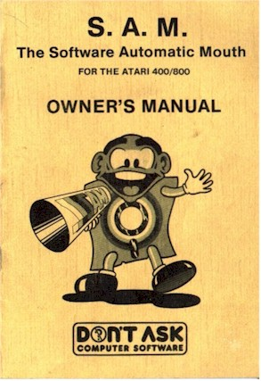
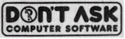

# _S.A.M._ - The Software Automatic Mouth



Written by Mark Barton  
S.A.M. and Reciter programs Documentation and packaging  
(c) 1982 -- Don't Ask, Inc.  


S.A.M. character designed by Gunnar Kullenberg



2265 Westwood Blvd. Suite B-150  
Los Angeles, CA 90064  
(213) 397-8811  

TABLE OF CONTENTS


- [DISCLAIMER AND LIMITED WARRANTY](#ch0.0)
- [INTRODUCTION](#ch0.1)
- [THE S.A.M. DISKETTE](#ch0.2)
- [USING THE S.A.M. PROGRAMS](#ch0.3)
- [RUNNING THE DEMO PROGRAMS](#ch0.4)
- [USING S.A.M. FROM ATARI BASIC](#ch0.5)
- [USING RECITER FROM ATARI BASIC](#ch0.6)
- [USE OF S.A.M. AND RECITER FROM MACHINE LANGUAGE](#ch0.7)
- [THE RECITER PROGRAM](#ch0.8)
- [THE SAYIT PROGRAM](#ch0.9)
- [I. THE PHONETIC SPELLING SYSTEM](#ch1.0)
  - [PHONEME CHART](#ch1.1)
- [II. ADDING STRESS TO S.A.M.'S SPEECH](#ch2.0)
- [III.THE EFFECTS OF PUNCTUATION](#ch3.0)
- [IV. FINAL NOTES ON PHONETIC INPUT](#ch4.0)
- [THE USE OF PITCH AND SPEED CONTROLS](#ch5.0)
  - [WHAT AM I HEARING?](#ch5.1)
  - [ENGLISH-TO-PHONETIC SPELLING DICTIONARY](#ch5.2)
  - [FINDING PHONEME SPELLING ERRORS](#ch5.3)
  - [TECHNICAL NOTES](#ch5.4)
  - [IMPORTANT ADDRESSES](#ch5.5)
  - [LISTING OF GUESSNUM](#ch5.6)
  - [FUTURE IMPROVEMENTS](#ch5.7)
  - [S.A.M. WEB LINKS!](#ch5.7)


**Atari is a trademark of Atari, Inc/Warner Communications**

**Software Automatic Mouth is a trademark of Don't Ask Inc.**

**NOTICE:**

DON'T ASK does not guarantee the compatibility of the S.A.M. programs
with any other software packages, languages, operating systems, or
hardware devices other than those specifically discussed in this manual.

Information on compatibility with specific products may from
time-to-time become available upon request from DON'T ASK.

## <a name="ch0.0"></a>DISCLAIMER AND LIMITED WARRANTY

This software product and the attached instructional materials are sold
"AS IS" without warranty as to their performance. The entire risk as to
the quality and performance of the computer software program is assumed
by the user. The user, and not the manufacturer, distributor or
retailer assumes the entire cost of all necessary service or repair to
the computer software program. DON'T ASK Inc. shall have no liability
or responsibility to the purchaser or any other person or entity with
respect to any liability, loss or damage caused or alleged to be caused
directly or indirectly by this product, including but not limited to
any interruption in service, loss of service, loss of business and
anticipatory profits or consequential damages resulting from the use
or operation of the software, hardware, or documentation portions of
this product.  
However, to the original purchaser only, DON'T ASK Inc. warrants that
the medium on which the program is recorded will be free from defects
in materials and faulty workmanship under normal use and service for
a period of ninety (90) days from the date of purchase. If a defect in
the medium should occur during this period, the medium should be
returned for repair or replacement to DON'T ASK or to its authorized
dealer. After this ninety day period, media inoperable for any reason
may be returned to DON'T ASK only along with $5.00 for prompt
replacement. Hardware devices supplied with this product are
warrantied on a similar basis except that after the 90 day period,
replacement cost shall be $15.00.

The above warranties for goods are in lieu of all other express
warranties and no implied warranties of merchantability and fitness
for a particular purpose or any other warranty obligation on the part
of DON'T ASK shall last longer than ninety (90) days. Some states do
not allow limitations on how long an implied warranty lasts, so the
above limitation may not apply to you. This warranty gives you specific
legal rights, and you may also have other rights which vary from state
to state.

NOTICE:

Upon receipt of this computer program and associated documentation,
DON'T ASK grants to you a non-exclusive license to execute the enclosed
software and to make back-up copies of some of these computer programs
for your personal use only; and only on the condition that all copies
are conspicuously marked with the same copyright notices that appear on
the original. This software and accompanying instructional materials
are copyrighted. You are prohibited from reproducing, translating, or
distributing the software or instructional materials in any
unauthorized manner.
No portion of the software contained within this product may be
incorporated within or included with another computer program that is
to be sold, reproduced, or transferred to other parties in any way
without the express written permission of DON'T ASK, Inc. A run-time
package of the speech synthesis program is available to be licensed
directly from DON'T ASK. For further information contact:

DON'T ASK COMPUTER SOFTWARE  
Software Licensing  
3002 Midvale Ave.  
Los Angeles, CA 90034  

Don't Ask Computer Software reserves the right to make improvements in
the product described in this manual at any time and without notice.
DON'T ASK can have no responstbility for any errors, whether factual or
typographical, in this documentation.

## <a name="ch0.1"></a>INTRODUCTION

**Congratulations!**  
You have just purchased S.A.M. -- the Software Automatic Mouth -- a
versatile, high-quality speech synthesizer created entirely in
software. You have added quality speech to your personal computer for a
lower cost than ever before possible and, in the bargain, have gained
features that other speech synthesizers cannot offer.
S.A.M.  is designed to be easy to use. With a couple of simple program
statements, you can add speech to your BASIC or assembly-language
programs. When you have mastered the easy-to-learn phonetic alphabet,
the inflection system, and the use of pitch and speed controls, you
will be amazed at what you can make S.A.M. do. **And**, until then it
will already match the performance of other speech synthesizers.
We strongly suggest that you read this manual carefully while learning
to use S.A.M.  There are thorough discussions of S.A.M.'s features with
illustrative examples of how to implement them. There is also a
dictionary of useful words and their phonetic equivalents to help you
learn the phonetic spelling system.
Also remember that as a registered S.A.M. owner, you are entitled to
our services in answering your S.A.M.-related questions, providing
updates and improvements to the S.A.M. program at nominal cost, and
helping you with your applications of S.A.M. Yes, this is a
not-too-subtle hint that you should send in your S.A.M. owner
registration card today. We look forward to hearing from you.

## <a name="ch0.2"></a>THE S.A.M. DISKETTE

The S.A.M. diskette contains several programs.

1. The S.A.M. speech synthesis program

   This program will boot in automatically and will leave your
   computer, whether on its l shaped desk or other workstation,
   ready to accept speech input through BASIC or machine language
   programs.  
   The program occupies about 9K bytes.

2. RECITER --
   RECITER is the English text-to-speech program that interfaces the
   S.A.M. program with ordinary English text input.  
   It is not used for phonetic input and must be loaded in separately
   (see instructions). It occupies about 6K bytes.

3. SAYIT --
   A short BASIC program that allows you to type in strings of phonemes
   or text and hear them spoken immediately.

4. DEMO --
   A BASIC program that demonstrates some of S.A.M.'s features by
   telling a short story.

5. SPEECHES --
   Another BASlC program that features some familiar texts to be spoken
   aloud by S.A.M.

6. GUESSNUM --
   A vocal version of the old guess-the-number-between-one-and-one-
   hundred game. Great for kids.

We suggest that you do not write additional data on the S.A.M.
diskette. Remove it after loading the desired programs.

## <a name="ch0.3"></a> USING THE S.A.M. PROGRAMS

The S.A.M. program itself is a self-contained machine-language program
that automatically boots in from the S.A.M. diskette when a system
cartridge (e.g. BASIC or ASSEMBLER) is in the left slot. Programs using
S.A.M. in the phonetic mode can be run immediately at this point.

In order to allow maximum working space in Atari memory, S.A.M. has
been installed in a location that conflicts with some functions of the
Atari DOS 2.OS operating system. In particular, when the DOS menu must
be accessed, such as to load the RECITER program or the RS232 handler,
special care must be taken. We therefore ask you to take the following
steps:

1. Format a blank diskette using DOS 2.0S (S.A.M. is **incompatible**
   with other versions of DOS) and write the DOS files to the disk
   with the "H" option in DOS. <b>DO NOT</b> use the DOS from the
   S.A.M. disk to create the copy disk; use DOS from another disk.

2. Copy the programs from the S.A.M. diskette onto this new disk
   using the "`O`" (duplicate file) command followed by `*.*` to copy
   all the files (the "`J`" command will not work). The S.A.M. program
   will **not** be transferred to the new disk.

3. Make sure there is a `MEM.SAV` file on your copy disk and always
   leave it **unwrite-protected**.

4. To use S.A.M. in conjunction with DOS, boot the S.A.M. disk. Then
   remove it and place the copy disk you have created into your drive.
   Then type "`DOS`" to enter the DOS menu. You can now load machine
   language files such as `RECITER` via the "`L`" command in DOS. Just
   remember that in order to use DOS with S.A.M. in the system,there
   **must** be a `MEM.SAV` on the disk. To return to BASIC after
   loading in a file, use the "`B`" command. (See the DOS 2.0S manual
   for further information on the use of `MEM.SAV`.)

We have included a S.A.M.-and-RECITER-compatible bootstrap for the
RS232C handler on the S.A.M. diskette. Binary load it from DOS exactly
as you do with RECITER if you need to use the RS232 interface along
with S.A.M.

**The RS232 handler provided will only function if RECITER is already
loaded in. It will not work with S.A.M. alone.**

## <a name="ch0.4"></a> RUNNING THE DEMO PROGRAMS

Once S.A.M. is loaded into memory, you can run all four demo programs
on the S.A.M. disk (SAYIT, DEMO, SPEECHES, and GUESSNUM). These are all
Atari BASIC programs and run from the usual BASIC "RUN" command. To
operate SAYIT with English input, make sure you have binary-loaded
RECITER as well.


<a name="ch0.5"></a>
<center><b>USING S.A.M. FROM ATARI BASIC</b></center>

S.A.M. patches into Atari BASIC by the use of the reserved string
variable named SAM$ (easy to remember).

Two BASIC statments are all that are required to make S.A.M. speak. The
following statements inserted anywhere in an Atari BASIC program will
cause S.A.M. to speak the phrase "I am a computer".

     100 SAM$= "AY4 AEM AH KUMPYUW3TER."
     110 A= USR(8192)

By using Atari BASIC'S string handling capabilities, it is possible to
generate the SAM$ string from sentence fragments, data statements, text
files, etc. Just make sure the `SAM$` string is DlMensioned in your
program (it can be DIMensioned no more than 255 characters long). The
`GUESSNUM` program listed in this manual illustrates some of the
techniques of using S.A.M. in BASIC.


**SOME ADDITIONAL NOTES:**
1. To avoid stepping on S.A.M. with your Atari BASIC program, do not
   make any changes in the value of LOWMEM.
2. S.A.M. makes use of the "zero" sound register in the Atari (location
   `$D201`). You may use the other three sound registers undisturbed
   during vocal output. S.A.M. has no effect on Atari graphics modes
   other than using up memory that might be needed for large programs
   requiring high resolution (e.g. GR.8) graphic display.
3. S.A.M. disables interrupt requests and shuts down the ANTIC chip
   during vocal output. Therefore, the screen will blank out and the
   `BREAK` key will not operate while S.A.M. is speaking. See the
   Technical Notes for more details.

## <a name="ch0.6"></a>USING RECITER FROM ATARI BASIC

To use RECITER from Atari BASIC, follow this procedure:
1. Boot S.A.M. in from the S.A.M. diskette.
2. Enter DOS from a disk containing MEM.SAV and RECITER (see page 6).
3. Type "L" for Binary Load.
4. Type "RECITER".
5. When the DOS prompt returns, type "B" to get back into BASIC.
6. You are ready to use RECITER in your programs or in SAYIT.

Using RECITER from Atari BASIC is the same as using S.A.M. in his
phonetic mode. However, this time the string SAM$ is in plain English.
Also the calling address is different.

     100 SAM$= "I AM A COMPUTER."
     110 A= USR(8199)

Use of punctuation with RECITER is discussed later, but note that a
dash will be treated as a pause-making dash only if there is non-letter
(not A-Z) on both sides of it.
Examples: the dash in "YOU ARE A RAT-FINK" will not pause, but the dash
in "HELLO JIM - THIS IS ANN" will.

## <a name="ch0.7"></a>USE OF S.A.M. AND RECITER FROM MACHINE LANGUAGE

This is very similar to using S.A.M. from Atari BASIC except for one
change; you must do your own string handling. A string of ATASCII
characters (the same ones you would use in BASIC) is moved into
locations `$2014`-`2113`. The first character must be in `$2014` and
the last character, an `$9B` return character, marks the string's end.
Bytes after the `$9B` are not read by S.A.M. Following the string
definition, a JSR `$2004` is done and S.A.M. speaks. The use of RECITER
is the same except that you do a JSR `$200B` instead.

## <a name="ch0.8"></a> THE RECITER PROGRAM

RECITER is an English text-to-speech program that converts ordinary
text into phonemes that S.A.M. can understand. You simply supply output
strings of 256 characters or less to the program. RECITER takes care of
the rest.

The program uses about 450 rules to convert English into S.A.M.'s
phonetic language. Included among these rules are some stress markers
for situations where the stress choice is unambiguous. In addition,
S.A.M.'s usual punctuation rules still operate with some additional
symbols ("!", ";", and ":") being considered as periods. The net result
is that even directly-translated English text has a fair amount of
inflection.

RECITER also recognizes a number of special characters. Numbers are
read aloud, and several others are pronounced as well. If a character
is not understood by RECITER, it simply isn't passed to S.A.M.

We recommend use of RECITER (or any text-to-speech program, for that
matter) only for applications where the user has no control of the
text. For example, text already in a file, text received over a MODEM,
and text supplied by users unfamiliar with the phonetic system. Where
the highest quality speech with full inflection is desired, we urge you
to use S.A.M.'s phonetic system.

Don't be discouraged. though. You will find that RECITER will do a
better job of speaking from English text than other text-translator
products.

## <a name="ch0.9"></a> THE SAYIT PROGRAM

SAYIT is a short BASIC program that allows you to test many of S.A.M.
and RECITER's features by directly inputting the string `SAM$`.

If both S.A.M. and RECITER have been loaded in, you may opt for English
input when running the program.

Typing "`ctrl-N`" will allow you to input new pitch and speed values to
test these features. Once you have done so, the new pitch and speed
will remain until you type "`crtl-N`" again.


## PHONETIC INPUT TO S.A.M.

### <a name="ch1.0"></a> I. THE PHONETIC SPELLING SYSTEM

S.A.M. is equipped with a version of the easy-to-learn, very readable
International Phonetic Alphabet. There are about fifty phonemes which
will let you spell all the words in English. Some sounds from foreign
languages are not available in the system at this time.

Why use the phonetic system? There are two compelling reasons.
1. In the phonetic system, all the words will be pronounced correctly;
   and
2. You can put inflection into the speech however and wherever you
   want it.

If you have already tried the RECITER text-to-speech program, you know
that it does a fair job of pronouncing English words. However, it does
make mistakes. Some words sound a little strange and others are
difficult to understand. The reasons for this are not hard to
understand. English is a language of exceptions rather than rules;
words that are spelled alike are pronounced differently ("have" vs.
"gave"). A rule system like RECITER cannot pronounce all words
correctly unless it stores an enormous dictionary that takes up vast
amounts of memory. But the second flaw in text-to-speech conversion is
more serious. Such a rule system cannot decide where the stress belongs
in what is being said. The phonetic system in S.A.M., on the other
hand, allows you to decide where to accent syllables within a word and
where to stress words within a sentence.

So it is clear that the preferred way to make S.A.M. speak is with the
phonetic alphabet. But how hard is it to use? It's really easier than
writing in English because **you don't have to know how to spell!**
You only have to know how to say the word in order to spell it
phonetically.

Here is the complete list of phonemes, each presented with a sample
word containing its sound. Note that there are many vowels, which is why
they are all indicated by two letters rather than one.

The phonemes are classified into two categories: vowels and consonants.
Among the vowels are the simple vowel sounds such as the "i" in "sit",
the "o" in "slot", and the "a" in "hat". These vowels do not change
their quality throughout their duration. There are also vowels called
diphthongs such as the "i" in "site", the "o" in "slow", and the "a" in
"hate", as well as the "oi" in "oil" and the "ow" in "how". These vowels
start with one sound and end with another (e.g. "oi" glides from an "oh"
sound to an "ee" sound).

The consonants are also divided into two groups: voiced and unvoiced.
The voiced consonants require you to use your vocal chords to produce
the sound. Such sounds as "b". "I", "n", and "z" sounds fall into this
category. The unvoiced consonants, on the other hand, are produced
entirely by rushing air and include such sounds as the "p", "t", "h",
and "sh" sounds.


#### <a name="ch1.1"></a> PHONETIC ALPHABET FOR S.A.M.

The example words have the **sound** of the phoneme, not necessarily the
same letters.

|   VOWELS       ||
|----|------------|
| IY | f**ee**t   |
| IH | p**i**n    |
| EH | b**e**g    |
| AE | S**a**m    |
| AA | p**o**t    |
| AH | b**u**dget |
| AO | t**a**lk   |
| OH | c**o**ne   |
| UH | b**oo**k   |
| UX | l**oo**t   |
| ER | b**i**rd   |
| AX | g**a**llon |
| IX | d**i**git  |

|   DIPTHONGS    ||
|----|------------|
| EY | m**a**de   |
| AY | h**igh**   |
| OY | b**oy**    |
| AW | h**ow**    |
| OW | sl**ow**   |
| UW | cr**ew**   |

The following symbols are used internally by some of S.A.M.'s rules, but
they are also available to the user.

|   SYMBOLS                                   ||
|----|-----------------------------------------|
| YX | diphthong ending                        |
| WX | diphthong ending                        |
| RX | R after a vowel                         |
| LX | L after a vowel                         |
| /X | H before a non-front vowel or consonant |
| DX | "flap" as in pi**t**y                   |

| VOICED CONSONANTS  ||
|----|----------------|
| R  |  **r**ed       |
| L  |  a**ll**ow     |
| W  |  a**w**ay      |
| WH |  **wh**ale     |
| Y  |  **y**ou       |
| M  |  Sa**m**       |
| N  |  ma**n**       |
| NX |  so**ng**      |
| B  |  **b**ad       |
| D  |  **d**og       |
| G  |  a**g**ain     |
| J  |  **j**u**dg**e |
| Z  |  **z**oo       |
| ZH |  plea**s**ure  |
| V  |  se**v**en     |
| DH |  **th**en      |

| UNVOICED CONSONANTS ||
|----|-----------------|
| S  | **S**am         |
| SH | fi**sh**        |
| F  | **f**ish        |
| TH | **th**in        |
| P  | **p**oke        |
| T  | **t**alk        |
| K  | **c**a**k**e    |
| CH | spee**ch**      |
| /H | a**h**ead       |

| SPECIAL PHONEMES                   ||
|--------|----------------------------|
| **UL** | sett**le** (= AXL)         |
| **UM** | astron**om**y (= AXM)      |
| **UN** | functi**on** (= ASN)       |
| **Q**  | kitt**-**en (glottal stop) |


Note: The symbol for the "H" sound is **/H** A glottal stop is a forced
stoppage of sound.

On the phoneme chart, you will notice six phonemes -- YX, WX, RX, LX,
/X, and DX -- which are described as being used by S.A.M.'s rule system.
However, they have been provided with letter codes so that you may
experiment with these special sounds directly. YX and WX are weaker
versions of Y and W. RX and LX are smooth gliding versions of R and L.
/X is the "h" sound in "who", and DX is the quick flap of the tongue on
the upper palate as in the word "pi<b>t</b>y".

We are now ready to transcribe ordinary speech into its phonetic
representation. Let's use the following sentence as an example:

**I do my calculations on the computer.**

The first step is to say each word aloud and decide how many syllables
are in the word. a syllable has one vowel phoneme and its associated
consonants (if any). We then identify the proper vowel phoneme by
comparing its sound to lhe sounds listed in the table, and do the same
for the consonants. The resultant combination of phonemes is the
phonetic representation of the syllable. We do this for each syllable
in a word.

In our example. the first word -- "I" -- is a single phoneme, the
diphthong "AY". The next word -- "do" -- is a single syllable comprised
of the diphthong "UW" preceded by the voiced consonant "D". The phonetic
spelling is therefore "DUW". Similarly. the third word -- "my" -- again
uses the "AY" sound, this time preceded by an "M", resulting in "MAY".

The word "calculations" has four syllables. The first syllable
transcribes as "KAEL". The "c" sound is pronounced as "k". unlike the
"s" pronunciation in a word like "cell" (notice there is no "C" in the
phoneme table). The next syllable -- "cu" -- transcribes as "KYUW".
Note here that the "Y" sound prevents this syllable from being
pronounced as "coo". The third syllable comes out as "LEY", and the
fourth becomes "SHAXNZ". This word ends with a voiced sound "7" and
not the hissy "S" sound as in "list". You will rapidly discover that
many words contain the phonetic combinations "AXL". "AXM". and "AXN".
To enhance the readability of the phonetic spelling, the special symbols
"UL". "UM", and "UN" can be substituted for these combinations. The
"tions" syllable is now written as "SHUNZ". So, "calculations" becomes
"KAELKYUWLEYSHUNZ".

The next word "on" becomes "AAN", and "the" becomes "DHAX". By the way.
if the word "the" precedes a word beginning with a vowel, it gets
pronounced "thee" and is spelled "DHIY". You should also notice that the
"th" letter combination has two phonetic representations: unvoiced (TH)
as in "thin", or voiced (DH) as in "the".

By now. the steps used in getting from "computer" to "KUMPYUWTER" should
already be obvious. Try it.

Once you get used to the phonetic system, it will seem very easy and
obvious. Initially, there will be some spellings that seem tricky
(did you know that "adventure" has a "CH" in it?). However, the rule is
always to write the word the way you say it, not the way you spell it.

To help you learn the system fast, we have provided an
English-to-phonetic spelling dictionary of almost 1500 words. Many
common words are in the dictionary; some unusual ones are in it as well.
If you are really stuck on how to spell a word that isn't in the
dictionary, think of another word that sounds like it and that one may
be listed.

In any case, don't hesitate to experiment with the phonetic spelling
system. Let your ears be your guide. This system is easy to learn, easy
to use, easy to read, and you will be amazed at what you can do with it.

### <a name="ch2.0"></a> II. ADDING STRESS TO S.A.M.'S SPEECH

In the phonetic mode, S.A.M. is capable of speaking with a great deal of
inflection and emphasis. This gives a much more natural and
understandable quality to the speech than is otherwise possible.

The stress system for S.A.M. is particulary easy to use. There are eight
stress markers that can be used simply by inserting a number (1-8)
**after** the vowel to be stressed. For example. the monotonic
pronunciation of the word "hello" produced by the phonetic spelling
"/HEHLOW" becomes a much friendlier sounding greeting when spelled
"/HEH3LOW".

Why do **you** have to put in the stress markers? Simply because they
can go **anywhere** and S.A.M. has no way of knowing where you **want**
them to go. The following simple example will demonstrate this point to
you. Use the SAYIT program on your S.A.M. disk to hear the following
sample phrases.

We will have S.A.M. say

**"Why should I walk to the store?"**

in a number of different ways.

1. WAY2 SHUH7D AY WAO5K TUX DHAH STOH5R.
   (You want a reason to do it.)
2. WAY7 SHUH2D AY WAO7K TUX DHAH STOH5R.
   (You are reluctant to go.)
3. WAY5 SHUH7D AY2 WAO7K TUX DHAH STOHR.
   (You want someone else to do it.)
4. WAY5 SHUHD AY7 WAO2K TUX7 DHAH STOHR.
   (You'd rather drive.)
5. WAY5 SHUHD AY WAO5K TUX DHAH STOH2OH7R.
   (You want to walk somewhere else.)

Each of these stress examples has a slightly different meaning, even
though the words are all the same. Stress markers give you the ability
to let S.A.M. be expressive.

What do the stress markers do? The number you type tells S.A.M.to raise
(or lower) his pitch and elongate the associated vowel sound.

The number system works like this:

- 1 = very emotional stress
- 2 = very emphatic stress
- 3 = rather strong stress
- 4 = ordinary stress
- 5 = light stress
- 6 = neutral (no pitch change) stress
- 7 = pitch-dropping stress
- 8 = extreme pitch-dropping stress

When should you use each of these? It all depends on how you want S.A.M.
to sound. Say the words to yourself as expressively as you can and see
where your voice rises and falls. Remember, the smaller the number, the
more extreme the emphasis will be. Also, the stress markers will help
get difficult words pronounced correctly. If some syllable is not
enunciated sufficiently, put in a neutral stress marker.

A general rule is that the most important word or words in a sentence
get the most stress and the rest of the words get little or no stress.
However, words of more than one syllable should have stress marked on
their accented syllables (most dictionaries show which these are if you
are uncertain).

We will now assign stresses to our first example sentence about doing
calculations on the computer. The first word "AY" is usually an
important word (can you think of anyone more important?). We will write
it as "AY4", assigning ordinary stress. "DUW", the only verb, is also
important. We'll try "DUW4". "MAY" isn't very strong (unless you want
to draw attention to it) and it is a single syllable. so we will leave
it alone. "KAELKYUWLEYSHUNZ" is polysyllabic so we must identify the
accented syllables. It is also the most important word in the sentence
so it will have the strongest stress. "LEY" has the primary stress and
"KAEL" receives the secondary stress. so we will write
"KAE4LKYUWLEY3SHUNZ". "AAN" and "DHAX" are short, unstressed words.
"KUMPYUWTER" has a single accent on "PYUW" and gets written
"KUMPYUW4TER". So. our original sentence gets written

**AY4 DUW4 MAY KAE4LKYUWLEY3SHUNZ AAN DHAH KUMPYUW4TER.**

Try typing it into the SAYIT program compared to the unstressed version.

How about really unusual stress? When you place extraordinary emphasis
on a word, you do so by elongating its vowel sounds. S.A.M. can do the
same thing. For example, a call for help can become
"/HEH5EH4EH3EH2EH2EH3EH4EH5EHLP." You can always do this with the
ordinary vowel sounds, but be careful with the diphthongs. They are
complex sounds and if you repeat them, they will not do what you want
(e.g. "OYOYOYOYOYOY" sounds just like it reads in English). To extend
the diphthong sounds, you need to break them into component parts. So
"OY" can be extended with "OHOHIYIYIY", and "AY" can be extended with
"AAAAIYIYIY". You should experiment to find out just what you can do.

Unlike many other speech synthesis systems, S.A.M. allows you to control
consonant stresses directly. This is usually done to produce a special
tonal pattern in a word. Sometimes you might want a pitch rise on the
final phoneme occurring just before a comma. For example, try typing:
"AY4 YUWZ SAE5M3, AE4ND RIYSAY4TER." Notice how the pitch rises on the
"M". It is never necessary to specify stress for a consonant occurring
immediately before a stressed vowel. This is handled automatically.

Try to become familiar with the stress marker system. It makes all the
difference between an ordinary speech synthesizer and the very
expressive S.A.M.

### <a name="ch3.0"></a> III. THE EFFECTS OF PUNCTUATION

S.A.M. understands four punctuation marks. They are the hyphen, comma,
period, and question mark.

The hyphen (-) serves to mark clause boundaries by inserting a short
pause in the speech. It also has other uses to be discussed later. The
comma marks phrase boundaries and inserts a pause approximately double
that of the hyphen. The question-mark and period mark the end of
sentences, The period inserts a pause and also causes the pitch to fall.
The question-mark also inserts a pause, but it causes the pitch to rise.
Notice that not all questions should end with a question mark (rising
pitch), only those that require a yes-or-no answer. ("Are we hiking
today?" rises; "Why are we going to the woods?" falls at the end and
should be marked with a period).

### <a name="ch4.0"></a> IV. FINAL NOTES ON PHONETIC INPUT

S.A.M. is capable of speaking only 2.5 seconds of speech without a break
(this is the size of his "breath"). If the string to be spoken exceeds
this, S.A.M. will insert short breaks every 2.5 seconds. S.A.M.
**always** breaks at punctuation marks in anticipation of the following
phrase. So, if you don't like where S.A.M. broke up a phrase, you can
specify your own breaks with hypens. An example of this is: "I use the
telephone - to call out of town".

S.A.M. uses the spaces between words to makes his sentence-breaking
decisions. If a single word requires more than 2.5 seconds to say,
S.A.M. will not be able to insert his own breaks and will therefore be
unable to say the word.

In summary, the procedures outlined above may seem complex, but this is
because they were presented in fine detail. In reality, the steps become
automatic and you will soon be able to type in phonetics almost as fast
as you can type English text.

### <a name="ch5.0"></a> THE USE OF PITCH AND SPEED CONTROLS

S.A.M. is capable of speaking in a wide range of tones and at many
different rates.
Both pitch and speed controls are accessed bysingle POKES to memory
locations.

The following chart shows the effects of different values in the pitch
and speed registers.*

PITCH  
POKE PITCH,N

|N=           |             |
|-------------|-------------|
|00-20        | impractical |
|20-30        | very high   |
|30-40        | high        |
|40-50        | high normal |
|50-70        | normal      |
|70-80        | low normal  |
|80-90        | low         |
|90-255       | very low    |
|default = 64 |             |

SPEED  
POKE SPEED,M

| M=           |                       |
|--------------|-----------------------|
| 0-20         | impractical           |
| 20-40        | very fast             |
| 40-60        | fast                  |
| 60-70        | fast conversational   |
| 70-75        | normal conversational |
| 75-90        | narrative             |
| 90-100       | slow                  |
| 100-225      | very slow             |
| default = 72 |                       |

*see the memory reference chart for these locations

#### <a name="ch5.1"></a> WHAT AM I HEARING?

In recent years, many new speech synthesizers have appeared in the
marketplace. The techniques they use vary widely depending on the
intended application. Most synthesizers found in consumer products,
such as talking televisions or microwave ovens, use a "speech
compression" technique of one sort or another. These techniques require
a person to speak the needed words or entire sentences. The speech
waveform is then "compressed" using a mathematical algorithm and, as a
result, can then be stored in a memory chip without taking up a lot of
room. The synthesizer's job is to then take this compressed speech
information and expand it back into the original waveform. Some of these
systems work quite well, retaining the speaker's intonation and
sometimes even his or her identity. The processes used in such
synthesizers differ greatly from those used in unlimited vocabulary
synthesizers like S.A.M.

Let's follow the evolution of an unlimited vocabulary speech
synthesizer. First, we must define the task. Simply, we want to create
a system that will synthesize any English utterance. One way to begin
would be to record every possible utterance on tape and just play back
the right one whenever we need it. This would take up more tape or
computer memory than could ever exist, so this method is obviously not
too practical.

The next method might be to record all the English words and play them
back in a specific order to create sentences. This is certainly
practical. It would take up a large amount of memory, but it would work.
However, we have lost something in this process. The words now sound
disjointed because we have "spliced" the sentence together. Also, the
stress or inflection pattern of the sentence is either wrong or
non-existent. If we wanted an accurate stress pattern, we would need to
record every word in a number of different styles, at different pitches,
etc.

Such a system needs too much memory. So, let's break things down even
further and try to store as little as possible in memory. Instead of
storing sentences or words or even syllables, we could store phonemes.
Phonemes are the atoms of spoken language, the individual speech sounds.
It turns out that English has a little over forty of them. Wow -- this
takes up practically no memory at all! We could specify the phonemes in
the order we need to create words and sentences and really have
ourselves a system. So, we go and record the phonemes and play them back
to say the sentence, "I am a computer." Why can we barely understand it?
It seems we have broken things down a bit too far. When we chop the
words down to this level and then try to reassemble them, everything
that blends one sound into another is lost and the results are nothing
less than horrible.

But all is not lost, Our efforts are not wasted because we have the
acoustic phonetician to come to our rescue. These people deal in the
study of speech sounds and they can tell us just how to repair our
phoneme-based system. First, instead of recording the actual speech
waveform, we only store the frequency spectrums. By doing this, we save
memory and pick up other advantages. Second, we learn that we need to
store some data about timing. These are numbers pertaining to the
duration of each phoneme under different circumstances, and also some
data on transition times so we can know how to blend a phoneme into its
neighbors. Third, we devise a system of rules to deal with all this data
and, much to our amazement, our computer is babbling in no time.

The advantages in synthesizing speech in this way are tremendous. We use
very little memory for all the data and the rules to use that data, and
we also gain the ability to specify inflection, timing, and intonation.
This is because we have not stored actual speech sounds, only their
spectrums. (You can think of this as a printer needing only four colors
of ink to reproduce all the colors in a picture.)

Now, in actuality, we do not store all the spectrums, but only those
that are targets. Each phoneme has associated with it a target spectrum
which can be specified with very little data. The target may be thought
of as a "frozen" speech sound, the sound you would be making if your
mouth was frozen exactly in the middle of pronouncing the phoneme. The
timing rules tell the synthesizer how to move from target to target in
a manner that imitates the timing of a human talker.

S.A.M. is this type of synthesizer implemented entirely in software. It
has the tables of phoneme spectra and timing, together with the rules
for using this data to blend the sounds together into any English
utterance we may have in mind. We have traded some quality from the
method using all the recorded words, but what we have gained is
versatility, practicality, and the ability to do it all in real time,
with very little memory usage, on an inexpensive microcomputer.

#### <a name="ch5.2"></a> ENGLISH-TO-PHONETIC SPELLING DICTIONARY

[A](#dictA)
[B](#dictB)
[C](#dictC)
[D](#dictD)
[E](#dictE)
[F](#dictF)
[G](#dictG)
[H](#dictH)
[I](#dictI)
[J](#dictJ)
[K](#dictK)
[L](#dictL)
[M](#dictM)
[N](#dictN)
[O](#dictO)
[P](#dictP)
[Q](#dictQ)
[R](#dictR)
[S](#dictS)
[T](#dictT)
[U](#dictU)
[V](#dictV)
[W](#dictW)
[X](#dictX)
[Y](#dictY)
[Z](#dictZ)
[DAYS OF THE WEEK](#dictDays)
[MONTHS OF THE YEAR](#dictMonths)
[NUMBERS](#dictNums)
[STATES AND PROVINCES](#dictStates)
[UNITS](#dictUnits)

##### <a name="dictA"></a>- A -

- abandon = AHBAE4NDUN
- ability = AHBIH4LIXTIY
- able = EY4BUL
- abort = AHBOH4RT
- about = AHBAW4T
- above = AHBAH4V
- absolute = AE5BSOHLUW4T
- abuse = AHBYUW4S
- accelerate = EHKSEH4LEREYT
- accent = AE4KSEHNT
- accept = AEKSEH4PT
- access = AE4KSEHS
- accident = AE4KSIXDEHNT
- account = AHKAW4NT
- acknowledge = EHKNA4LIHJ
- action = AE4KSHUN
- active = AE4KTIHV
- address = AE4DREHS
- adjust = AHJAH4ST
- adult = AHDAH4LT
- advance = EHDVAE4NS
- adventure = AEDVEH4NCHER
- affair = AHFEY4R
- afford = AHFOH4RD
- after = AE4FTER
- age = EY4J
- agree = AHGRIY4
- air = EH4R
- airplane = EH4RPLEYN
- alarm = AHLAA4RM
- algebra = AE4LJAXBRAH
- alien = EY4LIYIXN
- allow = AHLAW4
- alone = AHLOW4N
- along = AHLAO4NX
- alphabet = AE4LFAXBEHT
- alternate = AO4LTERNIXT
- America = AHMEH4RIXKAH
- among = AHMAH4NX
- analysis = AHNAE4LIXSIXS
- and = AE4ND
- anger = AE4NXGER
- announce = AHNAW4NS
- answer = AE4NSER
- antenna = AENTEH4NAH
- anticipate = AENTIH4SIXPEYT
- apology = AHPAA4LAXJIY
- appear = AHPIY4R
- apple = AE4PUL
- appropriate = AHPROH4PRIYIXT
- approve = AHPRUW4V
- area = EH4RIYAH
- arm = AA4RM
- arrive = AHRAY4V
- ask = AE4SK
- assumption = AHSAH4MPSHUN
- astronomy = AHSTRAA4NUMIY
- Atari = AHTAA4RIY
- atom = AE4TUM
- attack = AHTAE4K
- audio = AO4DIYOW
- authority = AHTHOH4RIXTIY
- automatic = AO5TUMAE4TIXK
- auxiliary = AOKZIH4LYERIY
- available = AHVEH4LAXBUL

##### <a name="dictB"></a>- B -

- baby = BEY4BIY
- back = BAE4K
- bad = BAE4D
- balance = BAE4LIXNS
- bank = BAE4NXK
- bargain = BAA4RGUN
- base = BEY4S
- basic = BEY4SIHK
- battle = BAE4TUL
- beam = BIY4M
- beautiful = BYUW4TIXFUHL
- behave = BIY/HEY4V
- belief = BIXLIY4F
- beneficial = BEH4NAXFIH4SHUL
- betray = BIYTREY4
- better = BEH4TER
- bible = BAY4BUL
- bibliography = BIH5BLIYAA4GRAXFIY
- bicycle = BAY4SIXKUL
- billion = BIH4LYUN
- binary = BAY4NEHRIY
- bite = BAY4T
- black = BAE4K
- blast = BLAE4ST
- block = BLAA4K
- blood = BLAH4D
- board = BOH4RD
- bomb = BAA4M
- book = BUH4K
- boot = BUW4T
- boss = BAO4S
- bottle = BAA4TUL
- bottom = BAA4TUM
- box = BAA4KS
- boy = BOY4
- brain = BREY4N
- branch = BRAE4NCH
- break = BREY4K
- brief = BRIY4F
- bring = BRIH4NX
- broken = BROW4KIXN
- brother = BRAH4DHER
- budget = BAH4JIXT
- buffer = BAH4FER
- bug = BAH4G
- bureau = BYER4OW
- burglar = BER4GULER
- bus = BAH4S
- business = BIH4ZNIXS
- busy = BIH4ZIY
- by = BAY4
- byfe = BAY4T

##### <a name="dictC"></a>- C -

- cabinet = KAE4BUNIXT
- cable KEY4BUL
- calculate = KAE4LKYAXLEYT
- calendar = KAE4LUNDER
- call = KAO4L
- calorie = KAE4LERIY
- cancel = KAE4NSUL
- candy = KAE4NDIY
- cant = KAE4NT
- capacity = KAXPAE4SIXTIY
- captain = KAE4PTIXN
- capture = KAE4PCHER
- card = KAA4RD
- careful = KEH4RFUHL
- carry = KEH4RIY
- cartridge = KAA4RTRIXJ
- case = KEY4S
- cashier = KAE4SHIY4R
- cassette = KAXSEH4T
- catalog = KAE4TULAOG
- celebrate = SEH4LAXBREYT
- celestial = SULEH4SCHIYUL
- Celsius = SEH4LSIYAXS
- center = SEH4NTER
- certain = SER4TQN
- challenge = CHAE4LIXNJ
- change = CHEY4NJ
- channel = CHAE4NUL
- chapter = CHAE4PTER
- charge = CHAA4RJ
- chauvenism = SHOH4VIXNIHZUM
- Cheese = CHIY4Z
- child = CHAY4LD
- children = CHIH4LDRIXN
- chocolate = CHAO4KLIXT
- choreography = KOH5RIYAA4GRAXFIY
- Christmas = KRIH4SMAXS
- church = CHER4CH
- cinema = SIH4NUMAH
- circle = SER4KUL
- circuit = SER4KIXT
- circumstance = SER4KUMSTAENS
- citizen = SIH4TIXSUN
- city = SIH4TIY
- classify = KLAE4SIXFAY
- clear = KLIY4R
- close = KLOW4Z
- coaxial = KOHAE4KSIYUL
- coffee = KAO4FIY
- coherent = KOW/HEH4RIXNT
- cold = KOW4LD
- college = KAA4LIXJ
- color = KAH4LER
- comfortable = KAH4MFTERBUL
- command = KUMAE4ND
- common = KAA4MUN
- company = KAHM4PUNIY
- complain = KUMPLEY4N
- complex = KUMPLEH4KS
- component = KAHMPOH4NUNT
- computer = KUMPYUW4TER
- condition = KUNDIH4SHUN
- conscience = KAA4NSHUNTS
- console = KAA4NSOHL
- control = KUNTROH4L
- conversation = KAA5NVERSEY4SHUN
- coordinate = KOHWOH4DUNIXT
- corporation = KOH5RPEREY4SHUN
- correction = KOHREH4KSHUN
- count = KAW4NT
- country = KAH4NTRIY
- cousin = KAH4ZIXN
- create = KRIYEY4T
- critical = KRIH4TIXKUL
- culture = KAH4LCHER
- curious = KYUH4RIYAXS

##### <a name="dictD"></a>- D -

- danger = DEY4NJER
- data = DEY4TAH
- decay = DIXKEY4
- decibel = DEH4SIXBUL
- decrease = DIYKRIY4S
- definition = DEH5FUNIH4SHUN
- degree = DIXGRIY4
- delay = DIXLEY4
- demonstrate = DEH4MUNSTREYT
- department = DIYPAA4RTMIXNT
- desire = DIXZAY4ER
- develop = DIXVEH4LAHP
- dictionary = DIH4KSHUNEHRIY
- different = DIH4FRIXNT
- discount = DIH4SKAWNT
- distance = DIH4STIXNS
- distribution = DIH5STRAXBYUW4SHUN
- division = DIXVIH4ZHUN
- doctor = DAA4KTER
- double = DAH4BUL
- down = DAW4N
- drive = DRAY4V
- dungeon = DAH4NJUN

##### <a name="dictE"></a>- E -

- earth = ER4TH
- easy = IY4ZIY
- economics = IY5KUNAA4MIXKS
- education = EH5JUWKEY4SHUN
- either = IY4DHER
- eject = IXJEH4KT
- electricity = ULEHKTRIH4SIXTIY
- electronic = ULEHKTRAA4NIXK
- elementary = EH4LUMEH4NTRIY
- emphasis = EH4MFAXSIHS
- encyclopedia=EHNSAY5KLAXPIY4DIYAH
- energy = EH4NERJIY
- engineering = EH5NJUNIY4RIHNX
- enter = EH4NTER
- enunciate = IYNAH4NSIYEYT
- equal = IY4KWUL
- erase = IXREY4S
- error = EH4ROHR
- escape = EHSKEY4P
- estimate = EH4STUMIXT
- Europe = YUH4RAXP
- evil = IY4VUL
- exciting = EHKSAY4TIHNX
- explain = EHKSPLEY4N
- expression EHKSPREH4SHUN
- extra = EH4KSTRAH

##### <a name="dictF"></a>- F -

- face = FEY4S
- fail = FEY4L
- Fahrenheit = FEH4RIXN/HAYT
- false = FAO4LS
- family = FAE4MULIY
- fast = FAE4ST
- fatal = FEY4TUL
- father= FAA4DHER
- fault = FAO4LT
- female = FIY4MEYL
- fight = FAY4T
- figure = FIH4GYER
- file = FAY4L
- filter= FIH4LTER6
- finance = FAY4NAENS
- find = FAY4ND
- finger = FIH4NXGER
- finish = FIH4NIXSH
- fire = FAY4ER
- first = FER4ST
- flavor = FLEY4VER
- flight = FLAY4T
- flow chart = FLOW4CHAART
- flower = FLAW4ER
- fluorescent = FLUHREH4SIXNT
- focus = FOW4KAXS
- follow = FAA4LOW
- foot = FUH5T
- force = FOH4RS
- formula = FOH4RMYUXLAH
- forward = FOH4RWERD
- fraction = FRAE4KSHUN
- fragile = FRAE4JUL
- freedom = FRIY4DUM
- frequency = FRIY4KWUNSIY
- from = FRAH4M
- fuel = FYUW4L
- full = FUH4L
- function = FAH4NXKSHUN
- fundamental = FAH5NDUMEH4NTUL
- fuse = FYUW4Z
- fusion = FYUWSZHUN
- future = FYUW4CHER

##### <a name="dictG"></a>- G -

- gain = GEY4N
- galaxy = GAE4LAXKSIY
- game = GEY4M
- garbage = GAA4RBIXJ
- gasoline = GAE4SULIYN
- gate = GEY4T
- general = JEH4NERUL
- generate = JEH4NEREYT
- genius = JIY4NYAXS
- gentle = JEH4NTUL
- genuine = JEH4NUYXIXN
- geometry = JIYAA4MIXTRIY
- get = GEH4T
- giant = JAY4IXNT
- gift = GIH4FT
- glass = GLAE4S
- gnome = NOW4M
- go = GOW4
- gold = GOH4LD
- good = GUH4D
- gourmet = GUHRMEY4
- government = GAH4VERNMEHNT
- grand = GRAE4ND
- graphic = GRAE4FIXK
- gravity = GRAE4VIXTIY
- ground = GRAW4ND
- guarantee = GAE4RIXNTIY4
- guide = GAY4D
- gun = GAH4N
- gyroscope = JAY4RAXSKOWP

##### <a name="dictH"></a>- H -

- habit = /HAE4BIXT
- hacker = /HAE4KER
- hair = /HEH4R
- half = /HAE4F
- hallucination = /HULUW4SIXNEY5SHUN
- hand = /HAE4ND
- happy = /HAE4PIY
- hardware = /HAA4RDWEHR
- harmony = /HAA4RMUNIY
- have = /HAE4V
- head = /HEH4D
- heart = /HAA4RT
- helicopter = /HEH4LIXKAAPTER
- hello = /HEH4LOW
- here = /HIY4R
- hero = /HIY4ROW
- herta = /HER4TS
- hesitate = /HEH4ZIXTEY6T
- hexadecimal = !HEH5KSIXDEH4SUMUL
- high = /HAY4
- history = /HIH4STERIY
- hobby = /HAA4BIY
- hold = /HOW4LD
- home = /HOW4M
- honest = AA4NIXST
- horoscope = /HOH4RAXSKOWP
- hospital = /HAA4SPIXTUL
- hour = AW4ER
- house = /HAW4S
- however = /HAWEH4VER
- huge /HYUW4J
- human = /HYUW4MUN
- humor = /HUYW4MER
- husband = /HAH4ZBUND
- hyper = /HAY4PER
- hypothesis = /HAYPAA4THAXSIHS

##### <a name="dictI"></a>- I -

- I = AY4
- ice = AY4S
- idea = AYDIY4AX
- identical = AYDEH4NTIXKUL
- identity = AYDEH4N11XTIY
- illusion = IHLUX4ZHUN
- image = IH4MIXJ
- imagination = IHMAE4JIXNEY5SHUN
- immobilize = IXMOH4BULAYZ
- important = IHMPOH4RTUNT
- in = IH4N
- inch = IHN4CH
- included = IHNKLUX4DIXD
- income = IH4NKUM
- inconvenient = IHN5KUNVIY4NYUNT
- increase = IHNKRIY4S
- indeed = IHNDIY4D
- index = IH4NDEHKS
- indicate = IH4NDIXKEYT
- indirect = IH5NDEREH4KT
- individual = IH5NDIXVIH4JUWUL
- industry = IH4NDAHSTRIY
- inferior = IHNFIH4RIYER
- inflation = IHNFLEY4SHUN
- influence = IH4NFLUWIXNS
- information = IH5NFERMEY4SHUN
- -ing = IHNX
- inject = IHNJEH4KT
- injure = IH4NJER
- initial = IXNIH4SHUL
- inside = IHNSAY4D
- inspect = IHNSPEH4KT
- insulator = IH4NSULEYTER
- integer = IH4NTIXJER
- intelligent = IHNTEH4LIXJIXNT
- interest = IH4NTREHST
- interference = IH4NTERFIY4RIXNS
- intermittent = IH4NTERMIH4TNNT
- invader = IHNVEY4DER
- invent = IHNVEH4NT
- inverse = IH4NVERS
- involve = IHNVAA4LV
- iron = AY4ERN
- irrational = IHRAE4SHUNUL
- isolate = AY4SULEYT
- issue = IH4SHUW
- item = AY4TUM

##### <a name="dictJ"></a>- J -

- jacket = JAE4KIXT
- jam = JAE4M
- jargon = JAA4RGUN
- jazz = JAE4Z
- jiffy = JIH4FIY
- job = JAA4B
- join = JOY4N
- joke = JOW4K
- judge = JAH4J
- jump = JAH4MP
- junction = JAH4NXKSHUN
- junior = JUW4NYER
- just = JAH4ST
- jail = JEY4L
- jewelry = JUW4LRIY
- journey = JER4NIY
- jungle JAH4NXGUL
- junk = JAH4NXK

##### <a name="dictK"></a>- K -

- keep = KIY4P
- key = KIY4
- keyboard = KIY4BOHRD
- kilobyte = KIH4LAXBAYT
- kind = KAY4ND
- kingdom = KIH4NXGDUM
- knight = NAY4T
- knowledge = NAA4LIXJ

##### <a name="dictL"></a>- L -

- label = LEY4BUL
- lady = LEY4DIY
- language = LAE4NXGWIXJ
- large = LAA4RJ
- laser = LEY4ZER
- last = LAE4ST
- late = LEY4T
- laugh = LAE4F
- launch = LAO4NCH
- law = LAO4
- layer = LEY4ER
- lead = LIY4D
- lease = LIY4S
- lecture = LEH4KCHER
- left = LEH4FT
- legal = LIY4GUL
- legend = LEH4JIXND
- leisure = LIY4ZHER
- length = LEH4NTH
- letter = LEH4TER
- level = LEH4VUL
- liberal = LIH4BERUL
- life = LAY4F
- lift = LIH4FT
- light = LAY4T
- like = LAY4K
- limit = LIH4MIXT
- linear = LIH4NIYER
- liquid = LIH4KWIXD
- list = LIH4ST
- listen = LIH4SIXN
- literature = LIH4TERIXCHER
- little = LIH4TU
- load = LOW4D
- local = LOW4KUL
- location = LOWKEY4SHUN
- lock = LAA4K
- logarithm = LAO4GERIH5DHUM
- logical = LAA4JIHKUL
- long = LAO4NX
- look = LUH4K
- loop = LUW4P
- lose = LOW4Z
- love = LAH4V
- low = LOW4
- loyal = LOY4UL
- luminescence = LUW4MIXNEH5SIXNS
- lunatic = LUW4NAXTIH6K
- luxury = LAH4GZHERIY

##### <a name="dictM"></a>- M -

- machine = MAXSHIY4N
- madam = MAE4DUM
- made = MEY4D
- magazine = MAEGAXZIY4N
- magic = MAE4JIHK
- magnet = MAE4GNIXT
- magnitude = MAE4GNIHTUX5D
- mail = MEY4L
- main = MEY4N
- major = MEY4JER
- make = MEY4K
- malfunction = MAE5LFAH4NXKSHUN
- man = MAE4N
- manager = MAE4NIXJER
- maneuver = MUNUW4VER
- manipulate = MUNIH4PYUHLEYT
- manual = MAE4NYUWUL
- manufacture = MAE5NUYXFAE4KCHER
- many = MEH4NIY
- marginal = MAA4RJIXNUL
- market = MM4RKIXT
- marriage = MEH4RIXJ
- mass = MAE4S
- master = MAE4STER
- mate = MEY4T
- material = MAXTIH4RIYUL
- mathematics = MAE4THUMAE5TIXKS
- mature = MAXCHUX4R
- maximum = MAE4KSIXMUM
- may = MEY4
- meaning = MUY4NIHNX
- measure = MEH4ZHER
- mechanical = MIXKAE4NIHKUL
- mechanism = MEH4KUNIHZUM
- media = MIY4DIYAH
- medical = MEH4DIXKUL
- medium = MIY4DIYUM
- member = MEH4MBER
- memory = MEH4MERIY
- mental = MEH4NTUL
- menu = MEH4NYUW
- merchandise = MER4CHUNDAY5S
- merge = MER4J
- metal = MEH4TUL
- meter = MIY4TER
- method = MEH4THIXD
- micro = MAY4KROW6
- middle = MIH4DUL
- might = MAY4T
- mile = MAY4L
- military = MIH4LIXTEH6RIY
- million = MIH4LYUN
- mind = MAY4ND
- mineral = MIH4NERUL
- miniature = MIH4NIYAXCHER
- minimum = MIH4NIXMUM
- minus = MAY4NIXS
- miracle = MIH4RIXKUL
- miscellaneous = MIH5SULEY4NIYAXS
- missile = MIH4SUL
- mister = MIH4STER
- mixture = MIH4KSCHER
- mnemonic = NIXMAA4NIXK
- model = MAA4DUL
- modulation = MAA4JULEY5SHUN
- molecule = MAA4LIXKYUWL
- moment = MOH4MIXNT
- money = MAH4NIY
- monitor = MAA4NIXTER
- monolithic = MAANULIH4THIXK
- monotone = MAA4NAXTOW6N
- month = MAH4NTH
- moon = MUW4N
- morning = MOH4RNIHNX
- most = MOW4ST
- mother = MAH4DHER
- motion = MOW4SHUN
- motor = MOW4TER
- mouth = MAW4TH
- move = MUW4V
- much = MAH4CH
- multiply = MAH4LTIX6PLAY
- murder = MER4DER
- muscle = MAH4SUL
- music = MYUW4ZIXK
- must = MAH4ST
- my = MAY4
- myself = MAYSEH4LF
- mystery = MIH4STERIY


##### <a name="dictN"></a>- N -

- naive = NAY5IY4V
- name = NEY4M
- narrate = NAE4REYT
- narrow = NAE4ROW
- natural = NAE4CHERUL
- nature = NEY4CHER
- navigate = NAE4VIXGEYT
- near= NIY4R
- need = NIY4D
- negative = NEH5GAXTIH6V
- negotiate NIXGOW4SHIYEYT
- neighborhood = NEY4BER/HUH6D
- nerve = NER4V
- neutral = NUX4TRUL
- news = NUW4Z
- nice = NAY4S
- night = NAY4T
- noise = NOY4Z
- nomenclature = NOH4MIXNKLEY6CHER
- none = NAH4N
- normal = NOH4RMUL
- north = NOH4RTH
- nose = NOW4Z
- notation = NOHTEY4SHUN
- notice = NOW4TIXS
- nothing = NAH4THIHNX
- now = NAW4
- nuclear = NUX4KLIYER
- number= NAH4MBER


##### <a name="dictO"></a>- O -

- object = AA4BJEHKT
- obligation = AA5BLIXGEY4SHUN
- observe = AXBZER4V
- obvious = AA4BVIYAXS
- occational = AHKEY4ZHUNUL
- occupation = AA5KYUXPEY4SHUN
- ocean = OW4SHUN
- odd = AA4D
- of = AH4V
- off = AO4F
- offer = AO4FER
- office = AO4FIXS
- official = AHFIH4SHUL
- ogre = OW4GER
- ohm = OW4M
- oil = OY4L
- O.K. = OW4KEY
- old = OW4LD
- omen = OW4MUN
- on = AA4N
- open = OW4PUN
- operate = AA4PEREYT
- opinion = AHPIH4NYUN
- oppose = AHPOW4Z
- opposite = AA4PAXSIHT
- option = AA4PSHUN
- orbit = OH4RBIHT
- orchestra = OH4RKEHSTRAH
- order = OH4RDER
- ordinary = OH4RDIXNEHRIY
- organize = OH4GUNAYZ
- origin = OH4RIXJIXN
- oscillation = AA5SULEY4SHUN
- other = AH4DHER
- ought = AO4T
- out = AW4T
- outlet = AW4TLEHT
- output = AW4TPUHT
- outside = AWTSAY4D
- over = OW4VER
- own = OW4N
- oxygen = AA4KSAXJIXN

##### <a name="dictP"></a>- p -

- pack = PAEPAE4K
- package = PAE4KIXJ
- page = PEY4J
- paint = PEY4NT
- pair = PEH4R
- palace = PAE4LIXS
- panel = PAE4NUL
- paper = PEY4PER
- parabola = PERAE4BULAH
- paradox = PAE4RAXDAA6KS
- parallel = PAE4RULEH6L
- paragraph = PAE4RAXGRAEF
- pardon = PAA4RDUN
- parent = PEH4RUNT
- parity = PAE4RIXTIY
- park = PAA4RK
- part = PAA4RT
- particle = PAA4RTIXKUL
- particular = PAARTIH4KYUHLER
- pass = PAE4S
- patch = PAE4TCH
- pathetic = PAHTHEH4TIXK
- pattern = PAE4TERN
- pause = PAO4Z
- pay = PEY4
- payroll = PEY4ROW6L
- peculiar = PIXKYUW4LYER
- penalty = PEH4NULTIY4
- penetrate = PEH4NAXTREY6T
- perception = PERSEH4PSHUN
- perfect = PER4FIXKT
- period = PIH4RIYIXD
- permanent = PER4MUNIXNT
- permission = PERMIH4SHUN
- person = PER4SUN
- personality = PER4SUNAE5LIX1
- perspective = PERSPEH4KTIXV
- pet = PEH4T
- phantom = FAE4NTUM
- phase = FEY4Z
- phenomenon = FUNAA4MIXNU
- philosophy = FULAA4SAHFIY
- phoneme = FOW4NIYM
- photo = FOW4TOW
- physical = FIH4ZIXKUL
- physics = FIH4ZIXKS
- piano = PYAE4NOW
- pick = PIH4K
- picture = PIH4KCHER
- pilot = PAY4LIXT
- pin = PIH4N
- pirate = PAY4RIXT
- pistol = PIH4STUL
- pitch = PIH4TCH
- pity = PIH4TIY
- place = PLEY4S
- plan = PLAE4N
- planet = PLAE4NIXT
- plastic = PLAE4STIxK
- plausible = PLAO4ZAXBUL
- play = PLEY4
- please = PLIY4Z
- pleasure = PLEH4ZHER
- plectrum = PLEH4KTRUM
- plenty = PLEH4NTIY
- plot = PLAA4T
- plug = PLAH4G
- plus = PLAH4S
- poetry = POW4IXTRIY
- point = POY4NT
- poke = POW4K
- police = PULIY4S
- policy = PAA4LIXSIY
- polynomial = PAA5LIXNOH4MIYUL
- pop = PAA4P
- popular = PAA4PYULER
- population = PAA4PYULEY4SHUN
- port = POH4RT
- portable = POH4RTAXBUL
- positive = PAA4ZIXTIX6V
- position = PAXZIH4SHUN
- power= PAW4ER
- practice = PRAE4KTIHS
- precise = PRIXSAY4S
- prefer = PRIXFER4
- preliminary = PREIXLIH4MIXNEHRIY
- prepare = PRIXPEH4R
- present = PREH4ZIXNT
- press = PREH4S
- pressure = PREH4SHER
- prevent = PRIXVEH4NT
- primary = PRAY4MEHRIY
- primitive = PRIH4MIXTIX6V
- prince = PRIH4NS
- princess = PRIH4NSEHS
- print = PRIH4NT
- private = PRAY4VIXT
- probably = PRAA4BAXBLIY
- problem = PRAA4BLUM
- proceed = PROHSIY4D
- process = PRAA4SEHS
- produce = PRAXDUW4S
- professional = PRAXFEH4SHUNUL
- professor = PRAHFEH4SER
- profit = PRAA4FIXT
- program = PROW4GRAEM
- project = PRAA4JEHKT
- promise = PRAA4MIHS
- pronounce = PRUNAW4NS
- proper = PRAA4PER
- proportional = PRAXPOH4RSHUNUL
- protect = PRAXTEH4KT
- proud = PRAW4D
- psychiatrist = SAYKAY4AXTRIX6ST
- public = PAH4BLIXK
- publish = PAH4BLIHSH
- pull = PUH4L
- pulse = PAH4LS
- pure = PYUW4R
- push = PUH4SH
- put = PUH4T

##### <a name="dictQ"></a>- Q -

- quality = KWAA4LIXTIY
- quantity = KWAA4NTIXTIY
- question = KWEH4SCHUN
- quick= KWIH4K
- quiet = KWAY4IXT
- quit = KWIH4T
- quiz = KWIH4Z
- quote = KWOW4T
- quotient = KWOW4SHUNT


##### <a name="dictR"></a>- R -

- race = REY4S
- radar = REY4DAAR
- radiation = REY5DIYEY4SHUN
- radio = REY4DIYOW
- radius = REY4DIYAHS
- rain = REY4N
- random = RAE4NDUM
- range = REY4NJ
- rare = REH4R
- rate = REY4T
- rather = RAE4DHER
- ratio = REY4SHIYOW
- reach = RIY4CH
- reaction = RIYAE4KSHUN
- read = RIY4D
- realistic = RIY5LIH4STIXK
- reason = RIY4ZUN
- receive = RIXSIY4V
- reciter = RIXSAY4TER
- recognize = REH4KAXGNAYZ
- recommend = REH5KUMEH4ND
- record = REH4KERD
- recover = RIYKAH4VER
- rectangle = REH4KTAENXGUL
- reduce = RIXDUW4S
- refer = RIYFER4
- reference = REH4FERIXNS
- reflection = RIXFLEH4KSHUN
- refrigerator = RIXFRIH4JEREYTER
- region = RIY4JUN
- register = REH4JIXSTER
- regular = REH4GYUXLER
- reject = RIXJEH4KT
- relativity = REH5LAXTIH4VIXTIY
- relax = RIXLAE4KS
- relay= RIY4LEY
- release = RIXLIY4S
- relief = RIYLIY4F
- religion = RIXLUH4JUN
- remain = RIYMEY4N
- remember = RIXMEH4MBER
- remove = RIYMUX4V
- rent = REH4NT
- repeat = RIXPIY4T
- replace = RIXPLEY4S
- reply = RIXPLAY4
- report = RIXPOH4RT
- represent = REHPRIXZEH4NT
- reproduction = RIY5PRAXDAH4KSHUN
- republic = RIXPAH4BLIXK
- rescue = REH4SKYUW
- research = RIY4SERCH
- reserve = RIXZER4V
- resistance = RIXZIH4STUNS
- respect = RIXSPEH4KT
- response = RIXSPAA4NS
- rest = REH4ST
- restore = RIXSTOH4R
- retail = RIY4TEY6L
- return = RIXTER4N
- reverse = RIXVER4S
- review = RIXVYUW4
- revolution = REH5VULUXWSHUN
- rhapsody = RAE4PSAXDIY
- rhythm = RIH4DHUM
- rich = RIH4CH
- ride = RAY4D
- ridiculous = RIXDIH4KYULAXS
- right = RAY4T
- rigid = RIH4JIXD
- ring = RIH4NX
- rise = RAY4Z
- river = RIH4VER
- road = ROW4D
- rocket = RAA4KIXT
- roll = ROH4L
- room = RUW4M
- rough = RAH4F
- round = RAW4ND
- rubber= RAH4BER
- rule = RUW4L
- run = RAH4N
- rush = RAH4SH

##### <a name="dictS"></a>- S -

- sabotage = SAE5BAXTAA6ZH
- sacrifice = SAE4KRIXFAYS
- sad = SAE4D
- safe = SEY4F
- safety = SEY4FTIY
- saint = SEY4NT
- sale = SEY4L
- S.A.M. = SAE4M
- same = SEY4M
- sample = SAE4MPUL
- sanctuary = SAE4NXKCHUWEH6RIY
- sandwich = SAE4NWIXCH
- sarcasm = SAA4IRKAEZUM
- satisfaction = SAE4TIXSFAE4KSHUN
- savage = SAE4VIXJ
- save = SEY4V
- say = SEY4
- scale = SKEY4L
- scandal = SKAE4NDUL
- scarce = SKEY4RS
- scatter = SKAE4TER
- scenic = SIY4NIXK
- schedule = SKEH4JYUWL
- scheme = SKIY4M
- scholar = SKAA4LER
- school = SKUW4L
- science = SAY4IHNS
- scientific = SAY4UNTIH5FIXK
- scientific = SAY4AXNTIH5FIXK
- scissors = SIH4ZERZ
- score = SKOH4R
- scramble = SKRAE4MBUL
- scratch = SKRAE4CH
- scream = SKRIY4M
- screw = SKRUW4
- script = SKRIH4PT
- scroll = SKROW4L
- seal = SIY4L
- search = SER4CH
- season = SIY4ZUN
- second = SEH4KUND
- secret = SIY4KRIXT
- secretary = SEH4KRIXTEH5RIY
- section = SEH4KSHUN
- security = SIXKYUH4RIXTIY
- see = SIY4
- seek = SIY4K
- segment = SEH4GMIXNT
- self = SEH4LF
- sell = SEH4L
- semi- = SEH4MIY
- send = SEH4ND
- sensation = SEHNSEY4SHUN
- senior = SIY4NYER
- sense = SEH4NS
- sensible = SEH4NSIXBUL
- sensitive = SEH4NSIXTIX6V
- sentence = SEH4NTIXNS
- separate = SEH4PERIXT
- sequence = SIY4KWEHNS
- serial = SIH4RIYUL
- serious = SIH4RIYAHS
- serve = SER4V
- service = SER4VIXS
- session = SEH4SHUN
- set = SEH4T
- settle = SEH4TUL
- several = SEH4VERUL
- sex = SEH4KS
- shadow = SHAE4DOW
- shake = SHEY4K
- shame = SHEY4M
- shape = SHEY4P
- share = SHEY4R
- sharp = SHAA4RP
- she = SHIY4
- sheet = SHIY4T
- shield = SHIY4LD
- shift = SHIH4FT
- shock = SHAA4K
- shoot = SHUW4T
- shop = SHAA4P
- short = SHOH4RT
- should = SHUH4D
- show = SHOW4
- shy = SHAY4
- sick = SIH4K
- side = SAY4D
- sight = SAY4T
- sign = SAY4N
- signal = SIH4GNUL
- silent = SAY4LIXNT
- silver = SIH4LVER
- similar = SIH4MULER
- simple = SIH4MPUL
- simplicity = SIHMPLIH4SIXTIY
- simulator = SIH4MYULEYTER
- sin = SIH4N
- single = SIH4NXGUL
- sinister = SIH4NIXSTER
- sir = SER4
- siren = SAY4RIXN
- sit = SIH4T
- situation = SIH5CHUWEY4SHUN
- skeptical = SKEH4PTIXKUL
- sketch = SKEH4TCH
- skill = SKIH4L
- skip = SKIH4P
- slang = SLAE4NX
- sleep = SLIY4P
- sleeve = SLIY4V
- slip = SLIH4P
- slot = SLAA4T
- slow = SLOW4
- small = SMAO4L
- smart = SMAA4RT
- smell = SMEH4L
- smooth = SMUW4DH
- snap = SNAE4P
- so = SOW4
- social = SOW4SHUL
- society = SAXSAY4IXTIY
- soft = SAO4FT
- solar = SOW4LER
- soldier = SOH4LJER
- solemn = SAA4LUM
- solid = SAA4LIXD
- solitude = SAA4LIXTUW6D
- solution = SULUW4SHUN
- some = SAH4M
- somebody = SAH4MBAADIY
- song = SAO4NX
- soon = SUW4N
- sophisticated = SAXFIH4STIXKEYTIXD
- sorry = SAA4RIY
- sort = SOH4RT
- sound = SAW4ND
- south = SAW4TH
- space = SPEY4S
- spare = SPEY4R
- spatial = SPEY4SHUL
- speak = SPIY4K
- special = SPEH4SHUL
- specific = SPAXSIH4FIXK
- speculate = SPEH4KYULEYT
- speech = SPIY4CH
- speed = SPIY4D
- spell = SPEH4L
- spend = SPEH4ND
- sphere = SFIY4R
- spin = SPIH4N
- spiral = SPAY4RUL
- spirit = SPIH4RIXT
- splendid = SPLEH4NDIXD
- split = SPLIH4T
- spoil = SPOY4L
- spontaneous = SPAANTEY4NIYAHS
- sports = SPOH4RTS
- spot = SPAA4T
- spread = SPREH4D
- spring = SPRIH4NX
- spy = SPAY4
- square = SKWEH4R
- squeeze = SKWIY4Z
- stability = STAXBIH4LIXTIY
- staff = STAE4F
- stand = STAE4ND
- standard = STAE4NDERD
- star = STAA4R
- start = STAA4RT
- state = STEY4T
- static = STAE4TIXK
- station = STEY4SHUN
- stay = STEY4
- steady = STEH4DIY
- steer = STIY4R
- step = STEH4P
- stereo = STEH4RIYOW
- stick = STIH4K
- stimualte = STIH4MYULEYT
- stock = STAA4K
- stone = STOW4N
- stop = STAA4P
- store = STOH4R
- story = STOH4RIY
- straight = STREY4T
- strange = STREY4NJ
- strategy = STRAE4TIXJIY
- street = STRIY4T
- strength = STREY4NTH
- strike = STRAY4K
- strong = STRAO4NX
- structure = STRAH4KCHER
- stubborn = STAH4BERN
- student = STUW4DIXNT
- study = STAH4DIY
- stuff = STAH4F
- stupid = STUX4PIXD
- style = STAY4L
- subject = SAH4BJEHKT
- substance = SAH4BSTIXNS
- subtle = SAH4TUL
- succession = SAHKSEH4SHUN
- succeed = SAHKSIY4D
- such = SAH4CH
- sudden = SAH4DIXN
- suggest = SAHGJEH4ST
- sum = SAH4M
- summer = SAH4MER
- sun = SAH4N
- super = SUX4PER
- superb = SUXPER4B
- superior = SUXPIH4RIYER
- supply = SAXPLAY4
- support = SAXPOH4RT
- sure = SHUX4R
- surprise = SERPRAY4Z
- surroundings = SERAW4NDIHNXGZ
- suspend = SAHSPEH4ND
- swear = SWEH4R
- sweep = SWIY4P
- swell = SWEH4L
- swing = SWIH4NX
- syllable = SIH4LAXBUL
- symbol = SIH4MBUL
- symbolic = SIHMBAA4LIXK
- symmetric = SIHMEH4TRIXK
- sympathy = SIH4MPAXTHIY
- synchronize = SIH4NXKRAX5NAYZ
- synonym = SIH4NUNIXM
- system = SIH4STUM
- synthesizer = SIH4NTHAXSAYZER

##### <a name="dictT"></a>- T -

- tab = TAE4B
- table = TEY4BUL
- tactical = TAE4KTIXKUL
- tail = TEY4L
- take = TEY4K
- talent = TAE4LIX6NT
- tall = TAO4L
- talk = TAO4K
- tap = TAE4P
- tape = TEY4P
- target = TAA4RGIXT
- task = TEY4ST
- tax = TAE4KS
- teach = TIY4CH
- team = TIY4M
- technical = TEH4KNIXKUL
- technology = TEHKNAA4LAXJIY
- telephone = TEH4LAX6FOWN
- television = TEH4LAX6VIXZHUN
- temper = TEH4MPER
- tender = TEH4NDER
- tense = TEH4NS
- tension = TEH4NSHUN
- term = TER4M
- terminal = TER4MIXNUL
- terrestrial = TER6EH4STRIY6UL
- terrible = TEH4RAXBUL
- territory = TEH4RAXTOH6RIY
- terror = TEH4RER6
- test = TEH4ST
- testimony = TEH4STUMOHNIY
- text = TEH4KST
- than = DHAE4N
- than = DHAE4N
- thank = THAE4NXK
- that = DHAE4T
- the = DHAH4
- theater = THIY4AHTER
- then = DHEH4N
- theorem = THIY4RUM
- theory = THIY4RIY
- thermometer = THERMAA4MIXTER
- thesis = THIY4SIXS
- they = DHEY4
- thin = THIH4N
- thing = THIH4NX
- think = THIH4NXK
- this = DHIH4S
- thought = THAO4T
- threshold = THREH4SH/HOWLD
- through = THRUW4
- ticket = TIH4KIXT
- tight = TAY4T
- time = TAY4M
- tiny = TAY4NIY
- tired = TAY4ERD
- title = TAY4TUL
- together = TUXGEH4DHER
- tolerance = TAA4LERIXNS
- tone = TOW4N
- tool = TUW4L
- top = TAA4P
- toss = TAO4S
- touch = TAH4CH
- tough = TAH4F
- tournament = TER4NUMIXNT
- toward = TOH4RD
- toward = TOW4RD
- town = TAW4N
- toy = TOY4
- trace = TREY4S
- track = TRAE4K
- trade = TREY4D
- tradition = TRAXDIH4SHUN
- traffic = TRAE4FIXK
- trail = TREY4L
- trajectory = TRAXJEH4KTERY
- transaction = TRAENZAE4KSHUN
- transfer = TRAE4NSFER
- transform = TRAENSFOH4RM
- transistor = TRAENZIH4STER
- translate = TRAE4NZLEYT
- transmit = TRAE4NZMIXT
- transparent = TRAE5NSPEH4RIXNT
- transportation = TRAE5NZPOHRTEY4SHUN
- trap = TRAE4P
- treasury = TREH4ZHERIY
- tree = TRIY4
- trek = TREH4K
- tremendous = TRIXMEH4NDAXS
- trespass = TREH4SPAES
- trial = TRAY4UL
- trangle = TRAY4AENXGUL
- trick = TRIH4K
- trgger = TRIH4GER
- trim = TRIH4M
- trip = TRIH4P
- triple = TRIH4PUL
- triumph = TRAY4AHMF
- troll = TROW4L
- trophy = TROW4FIY
- trouble = TRAH4BUL
- truck = TRAH4K
- true = TRUW4
- truth = TRUW4TH
- trj = TRAY4
- tune = TUW4N
- tunnel = TAH4NUL
- turn = TER4N
- tutor = TUW4TER
- twist = TWIH4ST
- type = TAY4P
- typewriter = TAY4PRAYTER

##### <a name="dictU"></a>- U -

- ugly = AH4GLIY
- ultimate = AH4LTAX6MIXT
- uncle = AH4NKUL
- under = AH4NDER
- understand = AH5NDERSTAE4ND
- uniform = YUW4NIXFOHRM
- union = YUW4NYUN
- unit = YUW4NIXT
- universal = YUW5NIXVER4SUL
- unless = AHNLEH4S
- up = AH4P
- upset = AHPSEH4T
- urge = EH4RJ
- use = YUW4S
- utility = YUWTIH4LIXTIY

##### <a name="dictV"></a>- V -

- vacation = VEYKEY4SHUN
- vacuum = VAE4KYUWM
- vague = VEY4G
- valid = VAE4LIXD
- value = VAE4LYUW
- valve = VAE4LV
- vanadium = VUNEY4DIYUM
- vapor = VEY4PER
- variation = VEH5RIYEY4SHUN
- various = VEH4RIYAHS
- vary = VEH4RIY
- veal = VIY4L
- vector = VEH4KTER
- vegetable = VEH4JTAXBUL
- vehicle = VIY4IX6KUL
- ventilate = VEH4NTULEYT
- verb = VER4B
- versatile = VER4SAXTUL
- verse = VER4S
- version = VER4ZHUN
- vertical = VER4TIXKUL
- very = VEH4RIY
- veto = VIY4TOW
- vibration = VAYBREY4SHUN
- vicinity = VAXSIH4NIXTIY
- victory = VIH4KTERIY
- video = VIH4DIYOW
- village = VIH4LIXJ
- vinyl = VAY4NUL
- violation = VAY4AXLEY5SHUN
- virtue = VER4CHUW
- visible = VIH4ZIXBUL
- visit = VIH4ZIXT
- vital = VAY4TUL
- vocabulary = VOHKAE4BYULEHRIY
- vocal = VOW4KUL
- voice = VOY4S
- volt = VOW4LT
- volume = VAA4LYUWM
- voluntary = VAA4LUNTEH5RIY
- vote = VOW4T
- vowel = VAW4UL
- voyage = VOY4IXJ
- video = VIH4DIYOW

##### <a name="dictW"></a>- W -

- wafer = WEY4FER
- wage = WEY4J
- wait = WEY4T
- wake = WEY4K
- walk = WAO4K
- wall = WAO4L
- war = WOH4R
- warm = WOH4RM
- warp = WOH4RP
- warranty = WOH5RIXNTIY4
- wash = WAA4SH
- waste = WEY4ST
- watch = WAA4CH
- water = WAO4TER
- watt = WAA4T
- wave = WEY4V
- way = WEY4
- weak = WIY4K
- wealth = WEH4LTH
- wear = WEH4R
- wedding = WEH4DIHNX
- week = WIY4K
- weight = WEY4
- welcome = WEH4LKUM
- well = WEH4L
- were = WER4
- what = WHAH4T
- wheel = WHIY4L
- when = WHEH4N
- which = WHIH4CH
- while = WHAY4L
- whisper = WHIH4SPER
- white = WHAY4T
- who = /HUW4
- whole = /HOW4L
- wide = WAY4D
- wild = WAY4LD
- will = WIH4L
- win = WIH4N
- window = WIH4NDOW
- wing = WIH4NX
- winter = WIH4NTER
- wise = WAY4Z
- wish = WIH4SH
- with = WIH4TH
- wizard = WIH4ZERD
- woman = WUH4MUN
- women = WIH4MIXN
- wonder = WAH4NDER
- word = WER4D
- Wordrace = WER2DREYS
- work = WER4K
- world = WUH4RLD
- worry = WER4IY
- would = WUH4D
- wrap = RAE4P
- write = RAY4T
- wrong = RAO4NX

##### <a name="dictX"></a>- X -

- Zerox = ZIH4RAAKS
- X-ray = EH4KSREY
- xylophone = ZAY4LAXFOWN

##### <a name="dictY"></a>- Y -

- yacht = YAA4T
- yard = YAA4RD
- yawn = YAO4N
- year = YIH4R
- yellow = YEH4LOW
- yes = YEH4S
- you = YUW4
- your = YOH4R
- youth = YUX4TH

##### <a name="dictX"></a>- Z -

- zany = ZEY4NIY
- zero = ZIY4ROW
- zig-zag = ZIH3GZAEG
- zip = ZIH4P
- zodiac = ZOW4DIY6AEK
- zone = ZOW4N

##### <a name="dictDays"></a>- DAYS OF THE WEEK -

- Monday = MAH4NDEY
- Tuesday = TUW4ZDEY
- Wednesday = WEH4NZDEY
- Thursday = THER4ZDEY
- Friday = FRAY4DEY
- Saturday = SAE4TERDEY
- Sunday = SAH4NDEY

##### <a name="dictMonths"></a>- MONTHS OF THE YEAR -

- January = JAE4NYUXEHRIY
- February = FEH4BRUXEH6RIY
- March = MAA4RCH
- April = EY4PRIXL
- May= MEY4
- June = JUW4N
- July = JUHLAY4
- August = AO4GAXST
- September = SEHPTEH4MBER
- October = AAKTOW4BER
- November = NOHVEH4MBER
- December = DIHSEH4MBER

##### <a name="dictNums"></a>- NUMBERS -

- one = WAH4N
- two = TUW4
- three = THRIY4
- four = FOH4R
- five = FAY4V
- six = SIH4KS
- seven = SEH4VIXN
- eight = EY4T
- nine = NAY4N
- ten = TEH4N
- eleven = IXLEH4VIXN
- twelve = TWEH4LV
- thirteen = THER4TIY6N
- twenty = TWEH4NTIY
- thirty = THER4TIY
- hundred = /HAH4NDRIXD
- thousand = THAW4ZUND
- million = MIH4LYUN

##### <a name="dictStates"></a>- STATES AND PROVINCES -

- United States = YUWNAY4TIXD STEY4TS
- Alabama = AE4LAXBAE6MAX
- Alaska = AHLAE4SKAH
- Arizona = EH4RAXZOW5NAH
- Arkansas = AA4RKUNSAO
- California = KAE5LAXFOH4RNYAH
- Colorado = KAA5LAXRAA4DOW
- Connecticut = KAHNEH4TIXKAHT
- Delaware = DEH4LAXWEH6R
- Florida = FLOH4RIXDAH
- Georgia = JOH4RJAH
- Hawaii = /HAHWAY4IY
- Idaho = AY4DAH/HOW
- Illinois = IHLUNOY4
- Indiana = IH5NDIYAE4NAH
- Iowa = AY4AHWAH
- Kansas = KAE4NZIXS
- Kentucky = KEHNTAH4KIY
- Louisiana = LUXIY4ZIYAE5NAH
- Maine = MEY4N
- Maryland = MEH4RULIXND
- Massachusetts = MAE5SAXCHUW4SIXTS
- Michigan = MIH4SAXGUN
- Minnesota = MIH5NAXSOW4TAH
- Mississippi = MIH5SIXSIH4PIY
- Missouri = MIHZUH4RIY
- Montana = MAANTAE4NAH
- Nebraska = NAXBRAE4SKAH
- Nevada = NAXVAE4DAH
- New Hampshire= NUW6/HAE4MPSHER
- New Jersey = NUWJER4ZIY
- New Mexico = NUWMEH4KSIXKOW
- New York = NUWYOH4RK
- North Carolina = NOH4RTH KEH5RULAY4NAH
- North Dakota= NOH4RTH DAHKOW4TAH
- Ohio = OW/HAY4OW
- Oklahoma = OWKLAX6/HOW4MAH
- Oregon = OH4RIXGUN
- Pennsylvania = PEH5NSULVEY4NYAH
- Rhode Island = ROW5D AY4LUND
- South Carolina = SAW4TH KEH5RULAY4NAH
- South Dakota = SAW4TH DAXKOW4TAH
- Tennessee = TEH5NAXSIY4
- Texas = TEH4KSAXS
- Utah = YUW4TAO6
- Vermont = VERMAA4NT
- Virginia = VERJIH4NYAH
- Washington = WAA4SHIHNXTAHN
- West Virginia = WEH5ST VERJIH4NYAH
- Wisconsin = WIHSKAA4NSUN
- Wyoming = WAYOW4MIHNX
- Provinces of Canada = PRAA4VIXNSIXZ AHV KAE4NAXDAH
- Alberta = AELBER4TAH
- British Columbia = BRIH4TIXSH KAHLAH4MBIYAH
- Manitoba = MAE5NIXTOW4BAH
- New Brunswich = NUWBRAH4NZWIXK
- Newfoundland = NUW4FIXNLIXND
- Nova Scotia = NOH4VAX5KOW4SHAH
- Ontario = AANTEH4RIYOW
- Prince Edward Island = PRIH5NS EH4DWERD AY4LUND
- Quebec = KUHBEH4K
- Saskatchewan = SAESKAE4CHAXWAAN

##### <a name="dictUnits"></a>- UNITS -

- units = YUW4NIXTS
- inches = IH4NCHIXZ
- feet = FIY4T
- yards = YAA4RDZ
- miles = MAY4LZ
- centimeters = SEH4NTIXMIY6TERZ
- kilometers = KIXLAA4MIXTERZ
- acres = EY4KERZ
- ounces = AW4NSIXZ
- pounds = PAW4NDZ
- tons = TAH4NZ
- grams = GRAE4MZ
- teaspoons = TIY4SPUWNZ
- cups = KAH4PS
- pints = PAY4NTS
- quarts = KWOH4RTS
- gallons = GAE4LUNZ
- liters = LIY4TERZ
- degrees = DAXGRIY4Z

#### <a name="ch5.3"></a>FINDING PHONEME SPELLING ERRORS

If you have made a phonetic spelling mistake that causes S.A.M. to be
unable to break your string down into phonemes, he will beep twice at
you and come back to BASIC without speaking. The location of the bad
letter in the string is stored for you to examine. Also, you may PEEK
at this location in a program to see if there were any errors in
spelling and then make the required changes.

Here is a sample error-checking and display program:

     .
     .
     .
     100 SAM$="MAY VOY4C IHZ BIHZAA5R."
     110 A=USR(8192)
     120 IF PEEK(8211)&lt;255 THEN GOSUB 1000
     :REM ERROR CHECK
     .
     .
     .
     1000 REM ERROR DISPLAY -- ERROR APPEARS IN INVERSE
     1010 N=PEEK(8211):REM N IS POSITION OF ERROR
     1020 SAM$(N,N) = CHR$(ASC(SAM$(N,N))+128)
     1030 PRINT SAM$
     1040 RETURN

The inverse character marks the spot where S.A.M. could no longer
continue reading the string.

#### <a name="ch5.4"></a> TECHNICAL NOTES USE IN BASIC

S.A.M. from BASIC performs all stack housekeeping that is required.

When S.A.M. completes vocal output,the NMIEN (Non-maskable Interrupt
Enable) ($D40E) returns to the following conditions:

BIT 6 -- Vertical Blank Interrupt Enable = "on"  
BIT 7 -- Display List Instruction Interrupt Enable = "on"

All other registers are returned to OS shadow values within 1/60 second
after vocal output.

Note that during speech, the VBI is shut down so that the real-time
clock registers (18, 19, 20) do not advance.


SCREEN BLANK

The screen blanks during vocal output because Direct Memory Access (DMA)
causes gaps to be inserted into the speech waveform each time the 6502
processor waits for the ANTIC chip to access memory. The audible result
is extremely distorted speech when the screen is on.

If this speech quality is desirable for some application (or the screen
must remain on during speech), S.A.M. may be operated in the DMA-enabled
mode by POKE-ing a "1" into the "lights" register: <b>8210</b>. There
are different speed and pitch addresses to be used in this case. To
return to DMA-disabled speech, POKE a "0" into this register.

#### <a name="ch5.5"></a>IMPORTANT ADDRESSES

|&nbsp;                       |Decimal |Hex  |
|-----------------------------|--------|-----|
|S.A.M. from Atari BASIC      |8192    |$2000|
| S.A.M. from machine language|8196    |$2004|
|RECITER from Atari BASIC     |8199    |$2007|
|RECITER from machine language|8203    |$200B|
|SPEED (LIGHTS OFF)           |8208    |$2010|
|SPEED (LIGHTS ON)            |8206    |$200E|
|PITCH (LIGHTS OFF)           |8209    |$2011|
|PITCH (LIGHTS ON)            |8207    |$200F|
|DMA-enable                   |8210    |$2012|
|ERROR                        |8211    |$2013|
|ATASCII STRING               |8212    |$2014|

#### <a name="ch5.6"></a>LISTING OF GUESSNUM

[
**Download GUESSNUM.BAS (Atari BASIC)**](downloads/GUESSNUM.BAS)

```
10 REM ---- GUESSNUM ----
20 DIM SAM$(255),B$(50),C$(50)
30 SAM=8192:REM SAM'S ADDRE5S
40 GRAPHICS 2:? #6;"GUESS THE NUMBER":? #6;"BETWEEN 1 AND 100"
50 SETCOLOR 2,0,0
60 N=INT(99*RND(0))+1
70 SAM$="GEH3S DHAX NAH4MBER BIXTWIY5N WAH4N Q AEND WAHH6 /HAN4NDRIHD.":A=USR(SAM)
80 TRAP 80:INPUT G
90 IF G>99 THEN SAM$="DHAETS MON4R DHAEN WAHN /HAH4NDRIXD.":A=USR(SAM):GOTO 80
100 IF G<1 THEN SAM$="DHAE5TS LEH3S DHAEN WAH5N.":A=USR(SAM):GOTO 80
110 SAM$=""
120 IF G<10 THEN B$="":GOTO 340
130 DN G-9 GOTO 150,160,170,180,190,200,210,220,230,240
140 GOTO 250
150 B$="TEH4N":GOTO 460
160 B$="IHLEH4VIXN":GOTO 460
170 B$="TWEH4LV":GOTO 460
180 B$="THER4TIY6N":GOTO 460
190 B$="FOH4RTIY6N":GOTO 460
200 B$="FIH4FTIY6N":GOTO 460
210 B$="SIH4KSTIY6N":GOTO 460
220 B$="SEH4VUNTIY6N":GOTO 460
230 B$="EY4TIY6N":GOTO 460
240 B$="NAY4NTIY6N":GOTO 460
250 ON INT(G/10)-1 GOTO 260,270,280,290,300,310,320,330
260 B$="TWEH4NTIY6":GOTO 340
270 B$="THER4TIY6":GOTO 340
280 B$="FOH4RTIY6":GOTO 340
290 B$="FIH4FTIY6":GOTO 340
300 B$="SIH4KSTIY6":GOTO 340
310 B$="SEH4VUNTIY6":GOTO 340
320 B$="EY4T1Y6":GOTO 340
330 B$="NAY4NTIY6"
340 R=G-10*INT(G/10)
350 IF R=0 THEN GOTO 460
360 ON R GOTO 370,380,390.400,410,420,430,440,450
370 B$(LEN(B$)+1)="WAH5N":GOTO 460
380 B$(LEN(B$)+1)="TUW5":GOTO 460
390 B$(LEN(B$)+1)="THRIY5":GOTO 460
400 B$(LEN(B$)+1)="FOHR5":GOTO 460
410 B$(LEN(B$)+1)="FAY5V":GOTO 460
420 B$(LEN(B$)+1)="SIH5KS":GOTO 460
430 B$(LEN(B$)+1)="SEH5VUN":GOTO 460
440 B$(LEN(B$)+1)="EY5T":GOTO 460
450 B$(LEN(B$)+1)="NAY5N"
460 IF G>N+25 THEN C$=" IHZ MAH3CH TUW5 /HAY6.":GOTO 530
470 IF G>N+5 THEN C$=" IHZ TUW3 /HAY6.":GOTO 530
480 IF G>N THEN C$=" IHZ AN LIH3TUL TUW4 /HAY6, ":GOTO 530
490 IF C<N-25 THEN C$=" IHZ MAH3CH TUW4 LAXOW, ":GOTO 530
300 IF G<N-5 THEN C$=" IHZ TUW3 LAXOW. ":GOTO 530
310 IF C<N THEN C$=" IHZ AH LIH3TUL TUW4 LAXOW.":GOTO 530
320 IF C=N SAM$(LEN(SAM$)+1)="B$:SAM$(LEN(SAM$)+1)=C$":A=USR(SAM)
340 G<>N THEN GOTO 80
350 ? :? :? :? :? :GOTO 60
```

##### <a name="ch5.6.5"></a>SELDOM-USED PHONEME COMBINATIONS

|Phoneme Combination|You probably want  |Unless it splitssyllables like|
|-------------------|-------------------|------------------------------|
|GS                |GZ e.g. ba**gs**    |bu**gs**pray                  |
|BS                |BZ e.g. slo**bs**   |o**bs**cene                   |
|DS                |DZ e.g. su**ds**    |Hu**ds**on                    |
|PZ                |PS e.g. sla**ps**   |--                            |
|TZ                |TS e.g. cur**ts**y  |--                            |
|KZ                |KS e.g. fi**x**     |--                            |
|NC                |NXG e.g. s**inging**|**ing**rate                   |
|NK                |NXK e.g. ba**nk**   |Su**nk**ist                   |

#### <a name="ch5.7"></a> FUTURE IMPROVEMENTS

Improvements upon and modifications to the S.A.M. system may occur in
the future. Such new versions of S.A.M. will be made available at
nominal cost to <b>registered S.A.M. owners</b>.

We are also planning to release a new program called "SUPERECITER".
RECITER presently has a pronunciation accuracy of about 90%. SUPERECITER
will show a major improvement in this area. But, we need your help.

It you hear a word mispronounced by RECITER that you feel is important,
jot it down. Send us your list of these words (or proper names) so that
we may incorporate them into the expanded rule set of SUPERECITER. Your
contributions will be greatly appreciated.

S.A.M. is an ongoing project at DON'T ASK Computer Software. We welcome
your comments and suggestions on our software speech synthesis products.

**NOTES**

PRINTED IN USA

#### <a name="ch5.7"></a> SAM WEB LINKS!

Well, this little section wasn't in the original manual; however, I
believe that these links are important enough to be included in the
"2001 edition":

[Antic's V: device handler -- Owners of S.A.M. can use this program
to define the voice synthesizer as an I/O device-much like a printer
(i.e. LIST V:).
](http://www.atarimagazines.com/v3n10/assemblylanguage.html)

_html-ized by Dan Vernon -- June 2001_

_markdown-ized by Christian Schiffler -- May 2017_
